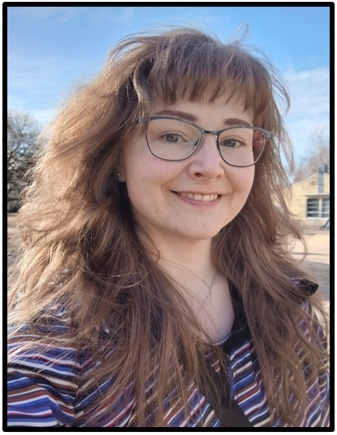

 
Self portrait 2025.
<h6></h6>
 
 

  
 _In 2015, I was the youngest ever to graduate in my major at the University of Helsinki (UH) - _
 _My doctoral dissertation dealt with physically based vegetation remote sensing, focusing on_
 _developing ground reference methods and validating different global satellite-based vegetation_
 _products in a boreal region. After I completed my doctoral dissertation, I had short research_
 _visit in USA (Duke university). Following 1.5-yr I continued to work at the UH, during which I_
 _extended my expertise into processing and applying airborne laser scanning data for quantifying_
 _forest canopy structures. During my years in UH, I participated in teaching remote sensing courses_
 _and leading GIS-practicals. Autumn 2016 I received postdoc position from the NIBIO (Norwegian _
 _Institute of Bioeconomy research), in a project that targeted towards developing methods for_
 _accounting forest management impacts in different land surface model (LSM) simulations employing_
 _prescribed landcover information. I developed a forest classification scheme and related landcover_
 _product for enhancing the description of managed Fennoscandic forests in different LSMs using_ 
 _Scandinavian forest inventory data. In addition, I refined the 'time invariant optical properties'_
 _-table that is used in LSM. I moved back to Finland mid-2019 and started working at the Aalto_
 _University Geoinformatics -section where I focused on themes of remote sensing of forest understory,_ 
 _forest landcover classification, and land surface phenology. After that (9/2021) opportunity emerged_
 _to expand my competence to forest biodiversity research at the UH, where I processed a landcover map_       _series to allow applying "ELITE-method" for forest biodiversity-analysis in Finland between 2000-2018,_
 _and created a simulator which extends the temporal window of ELITE-simulations until 2040 for analysing_
 _the impacts of alternative forest related biodiversity-policy decisions. Since 10/2022 I have worked_
 _with forest dynamics modeling for developing improved parameterizations for the European Forestry_ _Dynamics Model (EFDM) and soil carbon model Yasso._ 

                                       