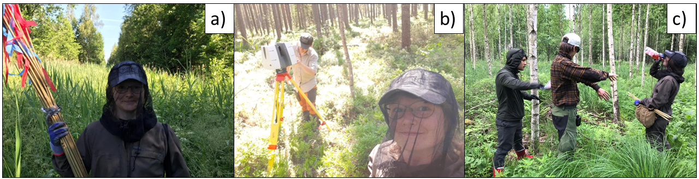

- __Occupation:__  University researcher
- __Institution:__ University of Helsinki ([UH](https://www.helsinki.fi/en/))
- __Department:__  Department of Forest Sciences
- __Located:__     Latokartanonkaari 7, 00790 Helsinki, Finland 
- __Project:__     PathFinder - Towards an integrated consistent European LULUCF monitoring and policy pathway assessment framework, Horizon Europe RIA 101056907 
- __PhD degree:__  University of Helsinki (Finland), Department of Forest Sciences
- __Expertise:__   
    - characterization of managed forests in land surface models
    - description of (boreal) forests in global land cover products
    - remote sensing (optical satellite data, airborne laser scanning)
    - fraction of absorbed Photosynthetically Active Radiation (fPAR) 
    - National Forest Inventory (NFI), forest management
    - Geographic Information System (GIS)
    - field measurements, ground validation
    - boreal forest phenology
    - boreal forest biodiversity
    - vegetation spectra 
    - Leaf Area Index (LAI) 

 

<h6></h6>
Fieldwork during summer 2020 in southern Estonia. Me standing with field plot marking sticks (a), colleague setting up laser scanner (Leica P40) (b), and we having a break for drinking and removing ticks (c). I thank my colleagues for providing the images.

    
 

<h6></h6>
Fieldwork using LAI-2000 device (a-b), camera with hemispherical lens (c), ASD spectrometer and reference   panel (d,e), and PASTIS device (f). I thank my colleagues for providing the images.

