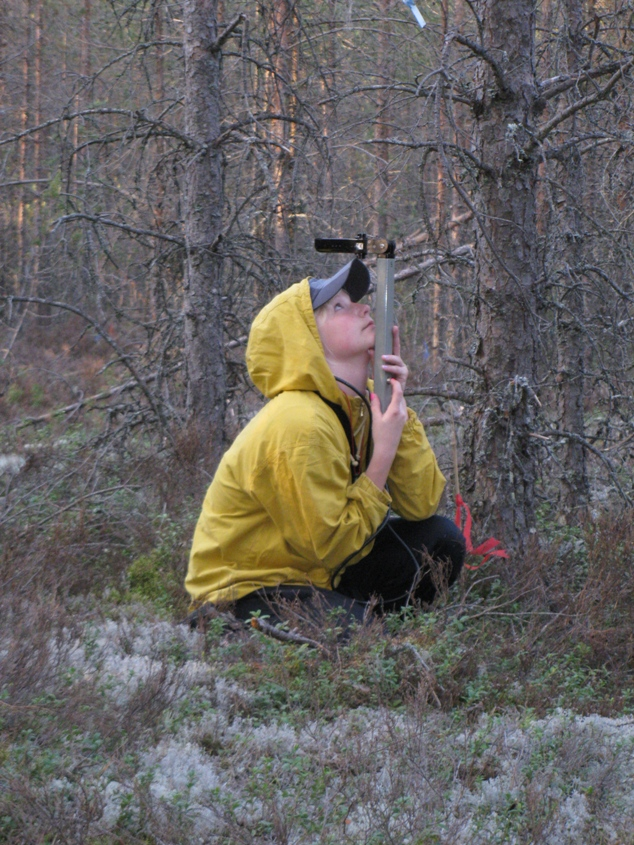
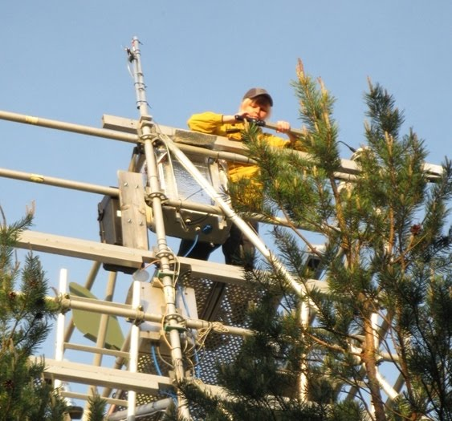
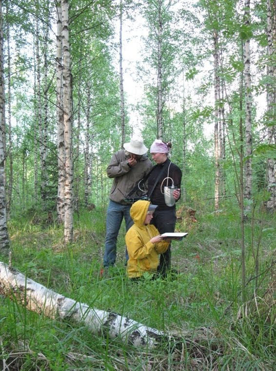
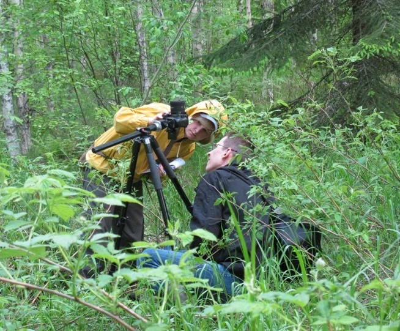

- __Occupation:__  Postdoctoral researcher
- __Institution:__ Norwegian Institute of Bioeconomy Research ([NIBIO](https://www.nibio.no/en/))
- __Division:__    Division for Forestry and Forest Resources, Forests and Climate
- __Located:__     Høgskoleveien 8, 1433 Ås, Norway 
- __Project:__     Integrating biogeophysical (BGP) mechanisms into assessments of  
               
 boreal forest management impacts on climate

 

- __PhD degree:__  University of Helsinki (Finland), Department of Forest Sciences
- __Expertise:__   
    - characterization of managed forests in land (climate) models
    - description of (boreal) forests in global land cover products
    - fraction of absorbed Photosynthetically Active Radiation (fPAR) 
    - National Forest Inventory (NFI) 
    - Geographic Information System (GIS)
    - vegetation remote sensing
    - Leaf Area Index (LAI) 
    - field measurements
    - ground validation
    - forest management 
    - boreal forest
    

 
  
  <h6>    </h6>**Fig. 1.** Fieldwork using LAI-2000 device and testing ASD spectroradiometer in   Hyytiälä forestry station, Finland, 2010. I thank my colleagues for providing the images.
  
  <h6>    </h6>**Fig. 2.** Fieldwork using PASTIS, hemispherical camera, and ASD devices. I thank my   colleagues for providing the images.

 
 
