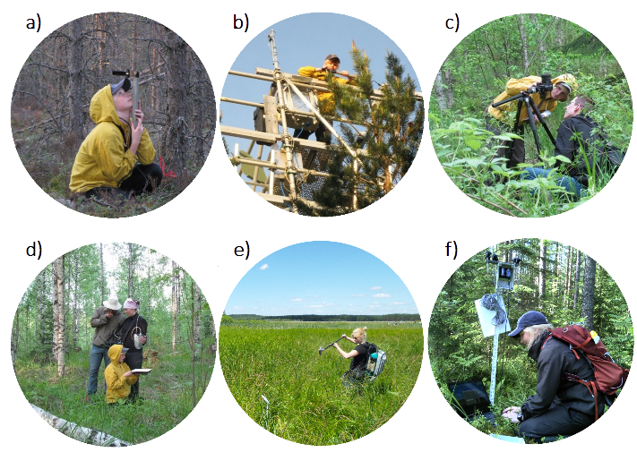

- __Occupation:__  Postdoctoral researcher
- __Institution:__ Aalto University ([Aalto](https://www.aalto.fi/en/))
- __Department:__  Department of build environment, Geoinformatics
- __Located:__     Otakaari 4, 02150 Espoo, Finland 
- __Projects:__    BOREALITY/13286390, 915544 post doc/GMA

 

- __PhD degree:__  University of Helsinki (Finland), Department of Forest Sciences
- __Expertise:__   
    - characterization of managed forests in land surface models
    - description of (boreal) forests in global land cover products
    - Geographic Information System (GIS)
    - Leaf Area Index (LAI) 
    - fraction of absorbed Photosynthetically Active Radiation (fPAR) 
    - vegetation spectral properties
    - field measurements
    - ground validation
    - boreal forest
    - National Forest Inventory (NFI) 
    - forest management 

    

 

<h6></h6>
Fieldwork using LAI-2000 device (a-b), camera with hemispherical lens (c), ASD spectrometer and reference   panel (d,e), and PASTIS device (f). I thank my colleagues for providing the images.

 
 
